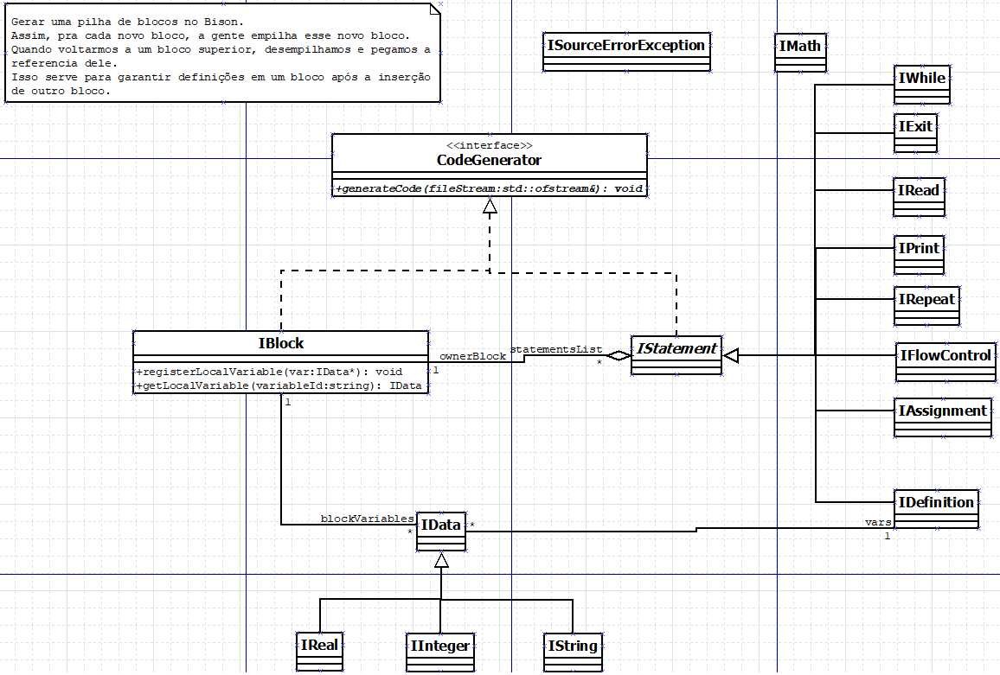

# I++ Compiler

The I++ Compiler is a compiler developed for the programming language I++.

## Summary

[The original documentation in Portuguese can be found [in here](./docs/pt/README.md)]

The I++ language and the compiler were developed by me during my undergraduate studies at the [Universidade Federal de Itajubá](https://unifei.edu.br/), where I studied Computer Engineering, from 2010 to 2014. They were, originally, developed for an assignment of the Compilers course, ministered by Prof. Dr. Thatyana de Faria Piola Seraphim.

The language was initially created with the mission of being used to teach (Portuguese speaking) kids the fundamentals of computer programming. However, it only served the purpose of teaching me the basics of how a compiler works and how a programming language is designed. I learned tons of stuff while developing this project and, who knows, I might try to improve it for fun. I am publishing this on GitHub with the hope that it might be useful for someone one day.

It should be noted that the majority of the project's assets (such as documentation) are written in Portuguese since it was an assignment for a course taught in a Brazilian university. I may (or may not) eventually translate everything to English one day. Also, important documentation about the language is missing (for instance, [deterministic finite automaton](https://en.wikipedia.org/wiki/Deterministic_finite_automaton) schemas, examples of [derivation trees](https://en.wikipedia.org/wiki/Parse_tree)).

This compiler uses [Flex](https://en.wikipedia.org/wiki/Flex_(lexical_analyser_generator)) for [lexical analysis](https://en.wikipedia.org/wiki/Lexical_analysis), [GNU Bison](https://en.wikipedia.org/wiki/GNU_Bison) for [parsing](https://en.wikipedia.org/wiki/Parsing) and g++ for the actual compiling of the input code.

## The language

The I++ language is a simplistic programming language based on the Portuguese language. Its primary objective was to incentivize and facilitate the learning of basic programming techniques by children.

Its reserved words are:
`inteiro`, `string`, `real`, `e`, `ou`, `repita`, `vezes`, `se`, `senão`, `enquanto`, `escreva`, `leia` and `sair`.

It has only three data types: integers (`inteiro`), real numbers (`real`), and strings (`string`)

It has the following instructions:

* `repita n vezes { code_block }`
   Repetition instruction that repeats the code block `code_block` `n` times. `n` can be either an inline numeric value or a numeric variable.

* `se (expression) { code_block } senão { another_code_block }`
   Instruction of flow control (an if/else block). The `senão` (else) block is not mandatory.

* `enquanto (expression) { code_block }`
   Repetition instruction that executes the block `code_block` until the expression `expression` becomes false.

* `escreva string` or `escreva (string)`
   An expression that outputs the message `string` to the standard output. You can use inline values such as `escreva "example"` which will output `example`, use predefined variables, or concatenate inline values and/or variables with the operator +.
    
* `leia variable`
   Reads user input from the standard input stream and writes it to the variable `variable`.

* `sair`
   Ends the program execution.

Math operators:
`+`, `-`, `*`, `/`

Logical operators:
`e`, `ou`

Comparison operators:
`==`, `!=`, `<`, `>`, `<=`, `>=`

More information and examples can be seen on the example programs on the folder `examples`

### Class diagram

## Pre-requisites

In order to compile the compiler you will need a UNIX system with the following tools:

1. [Make >= 4.2](https://www.gnu.org/software/make/)
2. [Boost Regex >= 1.73](https://www.boost.org/doc/libs/1_73_0/libs/regex/doc/html/index.html)
3. [Bison >= 3.0.2](https://www.gnu.org/software/bison/)
4. [Flex >= 2.6.4](https://github.com/westes/flex)
5. [g++ >= 4.8.1](https://gcc.gnu.org/projects/cxx-status.html) (since we use c++11)

PS1: The version of the tools shown are the ones I am sure the project would compile with. When I first implemented the compiler, I didn't actually write down the versions of the dependencies. Therefore, the project would maybe work with older versions.

PS2: This project can probably be compiled on Windows (or any other non-Unix systems) as well but I haven't tried (and, honestly, I am not sure if I wrote the whole code to be POSIX-Compliant - I just wanted my grades after all :P)

## Compiling

1. Install the dependencies mentioned in the [Pre-requisites](#Pre-requisites) section for your system
2. Clone the project: `git clone git@github.com:araujoigor/ipp-compiler.git`
3. Change to the newly created directory: `cd ipp-compiler`
4. Make the compiler: `make all`
5. Compile one of the example programs: `./bin/i++ examples/calculator.i ./bin/calculator`
6. Run the example program: `./bin/calculator`

## Why Flex and Bison?

Well... That's what was used by our professor to teach us how compilers work. This work was developed in 2013. I can only guess other now more famous tools (such as ANTLR) were not as widely adopted or not as good back then.

If I were to rewrite this project nowadays, I would definitely give ANTLR a try.

## Why not use something more elegant for compiling the code?

Well... I was in a rush... And even if not, it would have taken me forever to acquire the needed knowledge to do something `elegant`...

Back then, it felt like just converting each code block to pure C++ would be way faster than getting started with LLVM or learning how to write a frontend for GCC (which were and still are my preferred options for solving this problem). Also, given the context, it would more than get the job done (and it did :D).

## Known problems

If you use simple quotes within a string, it does not compile for whatever reason (that needs to be investigated).

The language itself was not carefully thought through. So you have a few shift/reduce, reduce/reduce conflicts, and even problems with types being very inconsistent. To be honest, there are tons of problems. But as long as this is useful for anyone (including me), then I am happy. And I can tell that developing this compiler made me a way better engineer.

## Next steps

So, if I have the drive and the time, I might translate all the comments and documentation into English. That's the first step.

Then, I might use this compiler as a full example of how to write your own programming language from the ground up. The fact that I decided to use Portuguese as the baseline for the actual grammar/syntax is a bit of a bummer, though.